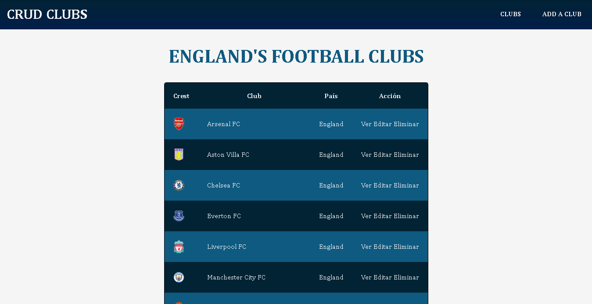
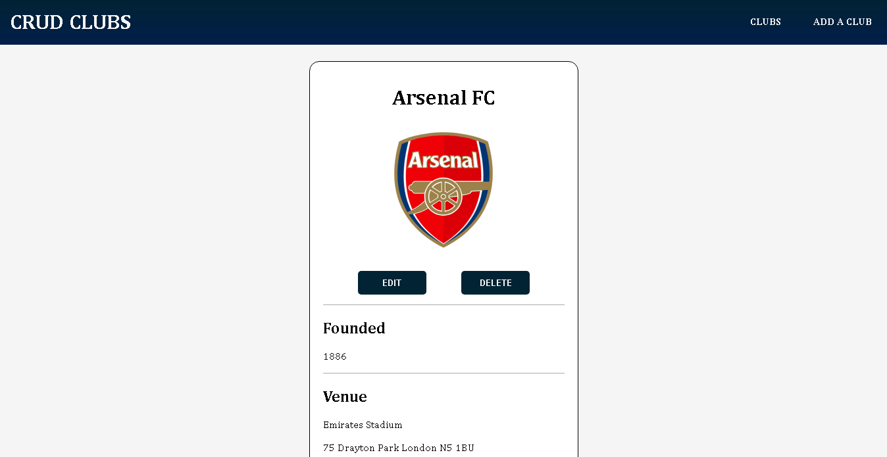
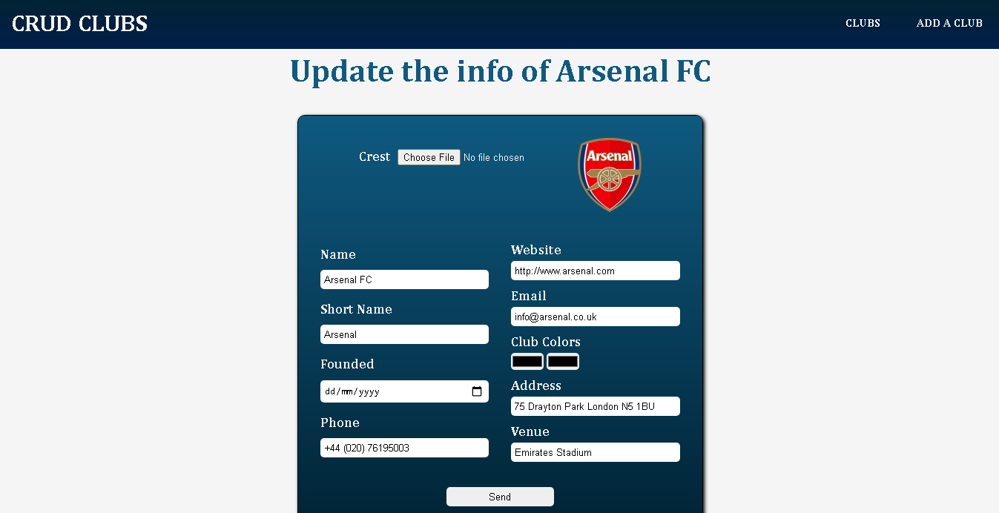

# CRUD-Clubes

App para crear, consultar, actualizar y eliminar (CRUD) equipos de Inglaterra usando Express + Handlebars.

## Para instalar este proyecto

Ejecutar `npm install` en el directorio root de la aplicación

## Scripts incorporados

```
npm start => corre el proyecto en modo producción (utilizando Node)
npm run dev => corre el proyecto en modo desarrollo (utilizando Nodemon)
```

## Por hacer

- [ ] Añadir manejo de errores.
- [ ] Unit Testing con Jest.
- [ ] Añadir funcionalidades en el frontend.
- [ ] Añadir mapa con la ubicación del club.
- [ ] Dividir la App en una Web API y una aplicación Frontend.

## Imágenes de la aplicación




